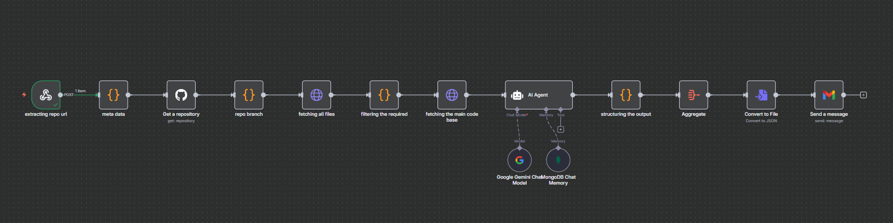

# 🤖 AI-Powered Code Reviewer with n8n

🚀 An automated **AI Code Reviewer** built using **n8n**, **Google Gemini**, and **MongoDB**, designed to analyze GitHub repositories and send structured review reports via email.  

👉 Live Input Page: [gh-ai-reviewer.netlify.app](https://gh-ai-reviewer.netlify.app/)  

---

## 📌 Features

- ✨ **End-to-End Automation** – From user input to AI review report  
- ✨ **AI-Powered Reviews** – Uses Google Gemini for professional code review  
- ✨ **GitHub Integration** – Fetches repository details & source files automatically  
- ✨ **Smart Filtering** – Skips unnecessary files (like binaries, media, oversized configs)  
- ✨ **Custom Prompts** – Users can provide custom review prompts  
- ✨ **MongoDB Memory** – Maintains chat memory for better context  
- ✨ **Email Reports** – Sends a structured JSON report as an attachment  

---

## 🛠️ Workflow Overview

The system is powered by an **n8n workflow** (see `final-ver-code-reviewer.json`).  

1. 🌐 **User Input Form** → GitHub Repo URL + Email + Optional Prompt  
2. 🔗 **Webhook (n8n)** → Captures input and parses repo info  
3. 📂 **GitHub API** → Fetches repository details & branch  
4. 🗂️ **File Filtering** → Keeps only relevant code/config files  
5. 📜 **File Fetching** → Downloads raw code files  
6. 🧠 **AI Agent (Gemini + MongoDB)** → Reviews code, outputs JSON  
7. ⚙️ **Structuring** → Formats JSON into clean structure  
8. 📦 **Aggregation** → Combines all file reviews  
9. 📧 **Email Delivery** → Sends report + JSON file to user  

---

## 📂 Tech Stack

- ⚡ **n8n** – Workflow automation  
- 🤖 **Google Gemini (PaLM API)** – Code analysis & AI review  
- 🐳 **MongoDB** – Chat memory & context storage  
- 🐙 **GitHub API** – Repository and file fetching  
- 📧 **Gmail API** – Sending review reports to users  
- 🌐 **Netlify** – Hosting input form frontend  

---

## 📊 Example Output

```json
{
  "repo": "my_animated_portfolio",
  "branch": "main",
  "reviewed_at": "2025-09-09T21:27:09.128Z",
  "file": "utils.js",
  "issues": [
    "No input validation for parameters",
    "Missing JSDoc comments"
  ],
  "suggestions": [
    "Add parameter type checking",
    "Include JSDoc comments for maintainability"
  ],
  "summary": "Simple utility file, minor improvements recommended"
}
```
## 📸 Image


## 🙌 Credits

- Built by Abdul Hannan

- Powered by n8n, Google Gemini, and MongoDB

